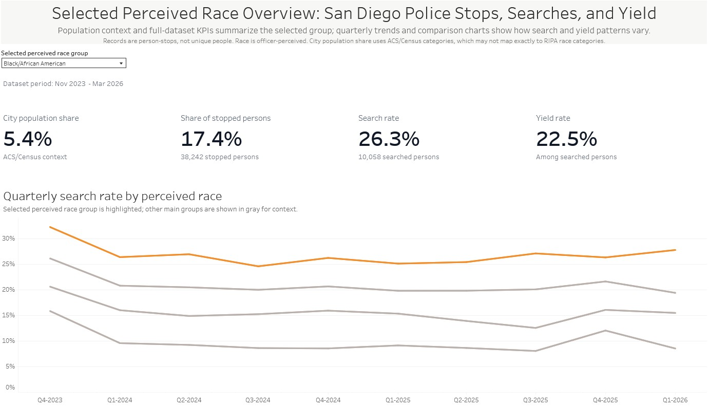
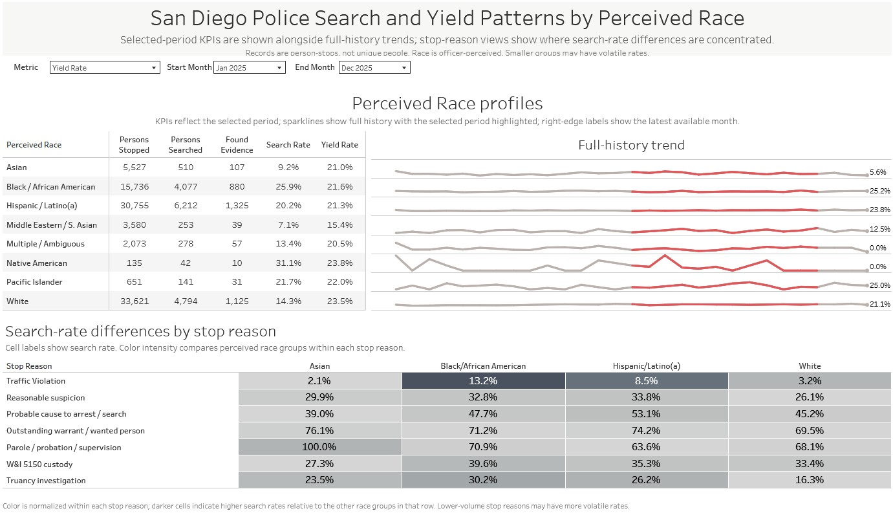

# San Diego Police Stops: Search and Yield by Perceived Race

This project analyzes San Diego police stop records from California Racial and Identity Profiling Act (RIPA) data, focusing on whether search and yield patterns differ by officer-perceived race after a person is stopped.

The project includes an automated cloud ingestion workflow, BigQuery raw tables, a dbt modeling layer, analytical marts, model documentation, a Google Sheets publication layer, and a Tableau Public dashboard.

## Live Dashboard

View the Tableau Public dashboard here:

[San Diego Police Stops - Search and Yield by Perceived Race](https://public.tableau.com/app/profile/alan.ward2828/viz/RIPATableauPublic/SDPoliceStops-Overview)

## Full Case Study

For a deeper walkthrough of the modeling approach, metric definitions, QA process, and project decisions, see the [full case study](CASE_STUDY.md).

## Dashboard Preview

### Overview



### Stop Reason Patterns



## Project Overview

This project examines search and yield patterns in San Diego police stop data. The main analytical question is:

> After a person is stopped, do search rates and yield rates differ by officer-perceived race?

The dashboard focuses on four main perceived-race groups: Asian, Black/African American, Hispanic/Latino(a), and White. It also includes broader race-profile summaries and stop-reason analysis to show where search-rate differences are most concentrated.

## Data Source

The project uses public San Diego RIPA police stop data and accompanying data dictionaries. The Tableau dashboard currently covers stops from November 2023 through March 2026.

The raw data files are stored in `data/`, including tables for stops, perceived race, search basis, stop reason, stop result, contraband/evidence, force actions, non-force actions, disability, and property seizure details.

Key caveats:

* Records are person-stops, not unique people.
* Race is officer-perceived, not self-identified.
* Search and yield metrics are observational and do not establish causal explanations.
* City population context uses ACS/Census categories, which may not map exactly to RIPA perceived-race categories.

## Pipeline Architecture

This project uses an automated, layered analytics workflow:

```text
Public RIPA CSV data
→ scheduled Python ingestion via Google Cloud Run
→ file storage in Google Cloud Storage
→ BigQuery raw source tables
→ dbt source definitions
→ dbt staging models
→ dbt intermediate models
→ dbt fact and mart models
→ dbt tests and documentation
→ automated output of analytical mart data to Google Sheets
→ Tableau Public dashboard connected to Google Sheets
→ dashboard QA and metric validation
```

This summary is intentionally high-level. The full project also included source configuration, model development, validation queries, dashboard design, and QA review.

The dbt source definitions are located in:

```text
models/staging/ripa/sources.yml
```

The final dashboard uses dbt mart models from:

```text
models/marts/
```

## Analytical Methodology

The core unit of analysis is the person-stop: one person associated with one recorded stop.

The main metrics are:

* **Stopped persons**: total person-stop records.
* **Searched persons**: person-stops with at least one recorded search basis.
* **Searched and found persons**: person-stops with both a recorded search and a recorded contraband/evidence finding.
* **Search rate**: searched persons divided by stopped persons.
* **Yield rate**: searched and found persons divided by searched persons.

The primary fact model is:

```text
models/marts/fct_ripa_person_stop.sql
```

This model has one row per person on a stop and includes search flags, find flags, perceived race, perceived gender, perceived age, agency, city, stop month, and stop reason.

The main dashboard marts are:

```text
models/marts/mart_search_yield_by_race_month.sql
models/marts/mart_search_yield_by_race_reason_month.sql
```

## Dashboard Walkthrough

The Tableau dashboard has two main views.

### San Diego Police Stops - Overview

The overview tab shows selected perceived-race group KPIs, including city population context, share of stopped persons, search rate, and yield rate. It also includes quarterly search-rate trends and overall search/yield comparisons across the four main perceived-race groups.

### San Diego Police Stop Reason Patterns

The stop-reason tab shows selected-period race profiles, full-history sparklines, search-rate differences by stop reason, and a detailed traffic-violation comparison. This view is designed to show where search-rate differences are most concentrated.

## Repository Structure

```text
data/
  Raw RIPA CSV files and data dictionaries.

models/staging/ripa/
  dbt staging models and source definitions for the raw RIPA source tables.

models/intermediate/
  Intermediate models for search flags, find flags, race summaries,
  stop-reason summaries, and person-stop outcomes.

models/marts/
  Final fact and mart models used for analysis and dashboarding.

dbt_project.yml
  Main dbt project configuration.

San Diego Police Stops - Search and Yield by Perceived Race.twb
  Tableau workbook file for the final dashboard.
```

## Key dbt Models

### `fct_ripa_person_stop`

One row per person on a stop, with search and find flags plus core demographic and stop context fields.

### `mart_search_yield_by_race_month`

Monthly search and yield summary by perceived race.

### `mart_search_yield_by_race_reason_month`

Monthly search and yield summary by perceived race and stop reason.

## Reproducing the dbt Project

The repository can be reviewed without access to the original BigQuery environment. The Tableau Public dashboard, dbt model files, documentation, and case study are intended to show the final analytical output and modeling approach.

To run the dbt project yourself, you would need to create your own Google Cloud / BigQuery environment, load the public RIPA CSV data into raw source tables, and configure a local dbt profile with access to that dataset.

This project uses a BigQuery profile named `ripa_police_data`. The expected raw source tables are defined in:

```text
models/staging/ripa/sources.yml
```

After configuring the BigQuery dataset and dbt profile, the project can be run with:

```bash
dbt run
dbt test
```

The expected raw source tables are defined under the `raw` source and include RIPA stops, race, search basis, stop reason, stop result, contraband/evidence, force actions, non-force actions, disability, and property seizure tables.

## Core Tools Used

* Python
* Google Cloud Run
* Google Cloud Storage
* BigQuery
* dbt
* SQL
* Google Sheets
* Tableau Public
* Git / GitHub

## Status

Completed portfolio project. The data pipeline is automated, the Tableau dashboard has been published, and the final outputs have been QA-checked against reference data.